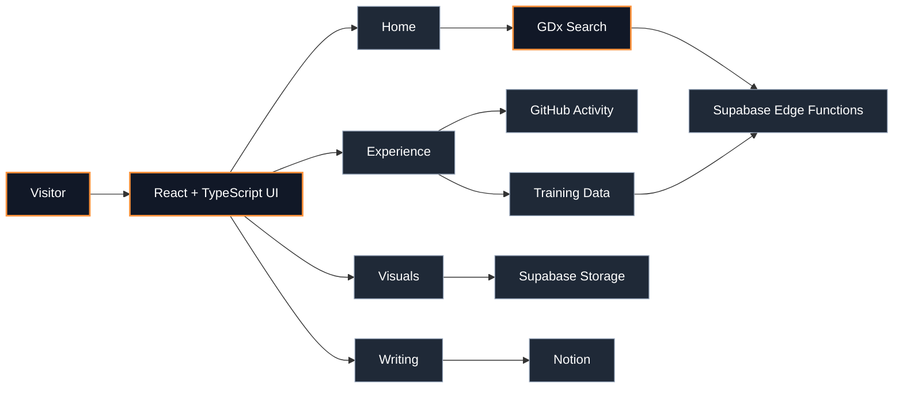
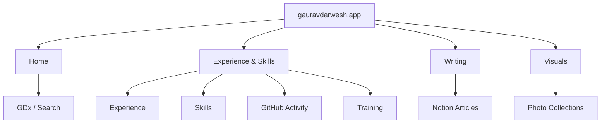

<!-- ========================================================= -->
<!--                     gauravdarwesh.app                     -->
<!-- ========================================================= -->

<div align="center">

  <h1>gauravdarwesh.app</h1>

  <p>
    <strong>A personal digital home for work, ideas, experiments, and the things I am curious about.</strong>
  </p>

  <p>
    <a href="https://gauravdarwesh.app">🌐 Visit the live website</a>
    &nbsp;•&nbsp;
    <a href="https://github.com/GauravDarwesh">GitHub</a>
    &nbsp;•&nbsp;
    <a href="https://linkedin.com/in/gauravdarwesh">LinkedIn</a>
    &nbsp;•&nbsp;
    <a href="https://strava.app.link/hNhQ2KtF94b">Strava</a>
  </p>

  <p>
    
    
    
    
    
  </p>

</div>

---

## ✦ What this is

This repository is the source code for **[gauravdarwesh.app](https://gauravdarwesh.app)** — a portfolio site designed less like a traditional resume and more like an interactive personal workspace.

| Area | What it does |
| --- | --- |
| **GDx** | An AI-style search interface for exploring the site and connected knowledge |
| **Experience** | Resume-style experience, skills, platforms, certifications, and extracurriculars |
| **Activity** | GitHub contribution activity and training information |
| **Writing** | A curated writing archive connected to Notion |
| **Visuals** | Photography and visual collections |
| **Themes** | Multiple site moods with persistent visual treatment and ambient audio |

The frontend is component-driven and keeps external services configurable through environment variables rather than committing credentials.

---

## ◉ Live experience

### [Open gauravdarwesh.app ↗](https://gauravdarwesh.app)

GitHub does not provide a safe way to run an arbitrary live webpage, iframe, or JavaScript application directly inside a repository README. Instead, this README uses GitHub-native interactivity: clickable navigation, collapsible sections, live links, and Mermaid-rendered diagrams.

The result is a README that behaves more like a guided product page while the real application stays one click away.

---

## ⌘ How the site fits together



### Page map



---

## ◈ The stack

**Frontend**

- React
- TypeScript
- Vite
- Tailwind CSS
- shadcn/ui
- Framer Motion
- React Router

**Data & integrations**

- Supabase Edge Functions
- Supabase Storage
- GitHub activity data
- Notion content

**UI / interaction**

- Responsive navigation
- Animated backgrounds
- Theme switching
- Ambient audio
- Interactive search
- Responsive activity and media views

---

## ◎ GitHub activity

<p align="center">
  <a href="https://github.com/GauravDarwesh">
    
  </a>
</p>

<p align="center">
  
</p>

<p align="center">
  <sub>
    Contribution activity is served directly from GitHub above; the statistics card is an additional visual summary.
  </sub>
</p>

---

## ⤷ Run locally

### 1. Clone

```bash
git clone https://github.com/GauravDarwesh/gauravdarwesh.app.git
cd gauravdarwesh.app
```

### 2. Install

```bash
npm install
```

### 3. Configure environment variables

Create a local .env file for your own backend configuration.

Example:

```env
VITE_SUPABASE_URL=your_project_url
VITE_SUPABASE_PUBLISHABLE_KEY=your_public_key
```

Never commit .env files, tokens, service-role keys, or other private credentials.

### 4. Start

```bash
npm run dev
```

### 5. Build

```bash
npm run build
```

---

## ▸ Repository structure

```text
.
├── public/
│   ├── favicon.ico
│   ├── music/
│   ├── robots.txt
│   └── sitemap.xml
│
├── src/
│   ├── components/
│   │   ├── SearchBar.tsx
│   │   ├── NavigationToggle.tsx
│   │   ├── AmbientSoundControl.tsx
│   │   └── ui/
│   │
│   ├── pages/
│   │   ├── Index.tsx
│   │   ├── Hobbies.tsx
│   │   ├── Blog.tsx
│   │   └── Visuals.tsx
│   │
│   └── lib/
│       ├── api.ts
│       ├── linkParser.ts
│       └── session.ts
│
├── index.html
├── package.json
├── tailwind.config.ts
└── vite.config.ts
```

---

## ✦ Design principles

> **Build the interface around the experience, not around the framework.**

The site keeps its visual identity opinionated, lets motion support navigation instead of overpowering it, and keeps environment-specific configuration outside the source tree.

---

<details>
<summary><strong>Explore the repository</strong></summary>

### Main routes

- / — home / GDx search experience
- /hobbies — experience, skills, activity, training
- /blog — writing archive
- /visuals — visual collections

### Useful entry points

- src/App.tsx — application shell and routing
- src/components/SearchBar.tsx — GDx interaction
- src/pages/Hobbies.tsx — experience and activity
- src/pages/Blog.tsx — writing archive
- src/pages/Visuals.tsx — visual collections
- src/lib/api.ts — backend communication

</details>

<details>
<summary><strong>Public / private boundary</strong></summary>

This repository intentionally contains the frontend and public-facing configuration only.

Backend implementation, database migrations, and deployment secrets are maintained outside this public source tree. Runtime configuration is supplied through environment variables.

</details>

---

## ◌ Links

<p align="center">
  <a href="https://gauravdarwesh.app">Website</a>
  &nbsp; · &nbsp;
  <a href="https://github.com/GauravDarwesh">GitHub</a>
  &nbsp; · &nbsp;
  <a href="https://linkedin.com/in/gauravdarwesh">LinkedIn</a>
  &nbsp; · &nbsp;
  <a href="https://instagram.com/allaboutgaurav">Instagram</a>
  &nbsp; · &nbsp;
  <a href="https://strava.app.link/hNhQ2KtF94b">Strava</a>
</p>

---

<div align="center">

  <sub>© 2026 Gaurav Darwesh. All rights reserved.</sub>

  <br />

  <sub>
    Source code is public for reference and portfolio purposes. Unless otherwise stated,
    the original code, content, design, media, and assets in this repository may not be
    reproduced, redistributed, or reused commercially without permission.
  </sub>

</div>
